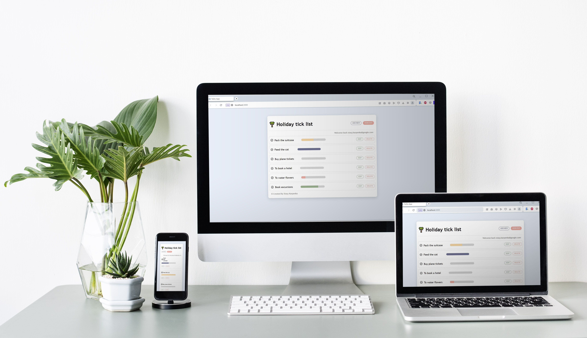

# 🌴 Holiday tick list
The classic implementation of the ToDo list, which includes most of the techniques and functionality that is used in real projects: authentication (registration and login using JWT), CRUD requests to get data, change it and delete it. Implemented the progress bar of the task and each time the color is randomly updated within the framework of the style. All this for one specific user. After an hour, when the token expires, the user is redirected to the login page again. The application consists of a client and a server part, the server part itself executes queries that perform various aggregations with the database. Also, the app has a responsive design.

`ReactJS`  `Redux`  `Node.JS`  `Express.JS`  `PostgreSQL`  `Sass`

# Preview 
<p align="center">
  
</p>
<p align="center">
   
</p>

# How to install 
1. Clone the repository:
```cmd
YourFolderName > git clone https://github.com/AKarpenka/to-do-application.git
```

2. Install npm packages for the client:
```cmd
to-do-application > cd client
to-do-application\client > npm i
```

3. Install npm packages for the server:
```cmd
to-do-application > cd server
to-do-application\server > npm i
```

4. Install npm packages for the entire application:
```cmd
to-do-application > npm i
```

5. Install postgresSQL and pgAdmin.
6. On the pg command line (or manually) reproduce the code to create a new database and tables from a `to-do-application>server/data.sql` file.


# How to run 
```cmd
to-do-application\server > npm run start
to-do-application\client > npm run start
```

<sub>Made in 2023</sub>
